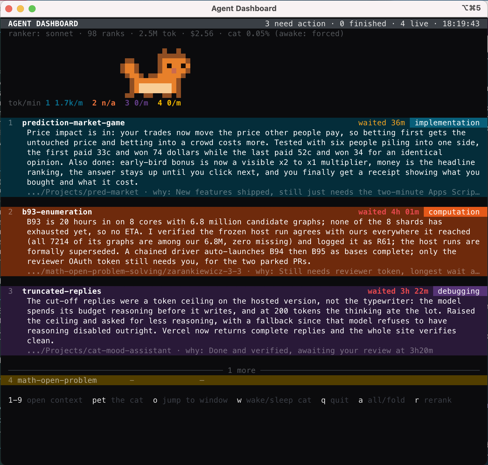

# agentdash

A live terminal dashboard for concurrent Claude Code sessions, built for iTerm2 on macOS.

Each session gets a card showing what it's doing, how long it's been waiting, and three sentences on what changed. A Claude ranking agent decides which sessions need you most and keeps them at the top. Every iTerm2 window gets its own colour; cards match their windows.



## Install

```sh
git clone <this repo> agent-dashboard
cd agent-dashboard
./install.sh
```

Requires macOS, iTerm2, and Python 3.8+. No pip dependencies. The `claude` CLI is optional — without it, ranking uses a built-in heuristic.

Restart iTerm2 once after installing, then:

```sh
agentdash open    # opens the dashboard in a new iTerm2 window
```

## Keys

| Key | Action |
| --- | --- |
| `1`–`9` | expand/collapse that session's ranker context |
| `a` | show all sessions / return to fold |
| `+` `-` | change how many rows stay expanded |
| `o` | bring the top session's window to front |
| `r` | force a rerank now |
| `m` | toggle mouse reporting (off by default) |
| `w` | force the cat awake/asleep/auto |
| `q` | quit |

## Reporting

Sessions report automatically once installed. By hand:

```sh
agentdash report --status question \
  --name "pool-leak-502s" \
  --tag debugging \
  --summary "Three sentences the user sees." \
  --context "Four sentences only the ranking agent sees."
```

`--status` is one of `working`, `done`, `question`, `blocked`. `question` and `blocked` start a visible waiting timer. `done` is quiet — it marks the session finished without competing for attention.

## Configuration

`~/.agent-dashboard/config.json` — everything has a default, override only what you need:

```json
{
  "top_n": 3,
  "blocked_red_seconds": 3600,
  "ranker_model": "sonnet",
  "ranking_enabled": true,
  "cat": true
}
```

`+` and `-` in the dashboard write `top_n` back to this file automatically.

## Container sessions

Sessions running in Docker are invisible by default. Bridge them in:

```sh
agentdash bridge install <container>
agentdash bridge list
agentdash bridge remove <container>
```

No network, no restart — records spool through a bind mount the container already has.

## Uninstall

```sh
agentdash uninstall            # remove wiring, keep state
agentdash uninstall --purge    # remove everything
```

## Troubleshooting

```sh
agentdash doctor    # checks every moving part
agentdash status    # current state as plain text
```

- **No colours:** enable iTerm2's Python API under Settings → General → Magic, then restart.
- **`agentdash: command not found`:** add `~/.local/bin` to your `PATH`, or open a new shell.
- **Rows never appear:** run `agentdash doctor` and check the hook count. Sessions must start after installing.

## Tests

```sh
./tests/run_all.sh
```

No iTerm2, Claude session, or network needed.
